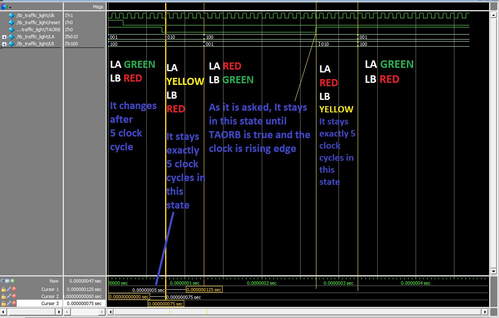

# Traffic Light Controller FSM (with Delay)

This repository contains the SystemVerilog implementation of a timed Finite State Machine (FSM) for a Traffic Light Controller, developed for the **ELE432 Advanced Digital Design** course at Hacettepe University.

## Project Overview
The assignment focuses on designing a 4-state FSM to manage traffic at an intersection (Street A and Street B). A key requirement is the implementation of a **5-second delay** for all yellow light transitions using an internal timer.

### Key Features
* **FSM States:** Supports four distinct states (Green/Red transitions).
* **Timer Logic:** Internal counter manages the 5-unit delay for S1 and S3.
* **Input Sensitivity:** Transitions between Street A and Street B are controlled by the `TAORB` signal.

## Simulation Results
The following waveform from QuestaSim verifies the timing accuracy and state transition logic:

## Implementation
* **Language:** SystemVerilog
* **Tools:** QuestaSim / Vivado
* To run the simulation, pick `FSM_Traffic_Lights.sv` as your top entity. Afterwards, run `TB.sv` in your desired simulator.

## Author
* Ali Özyüksel - Hacettepe University, Electrical and Electronics Engineering
